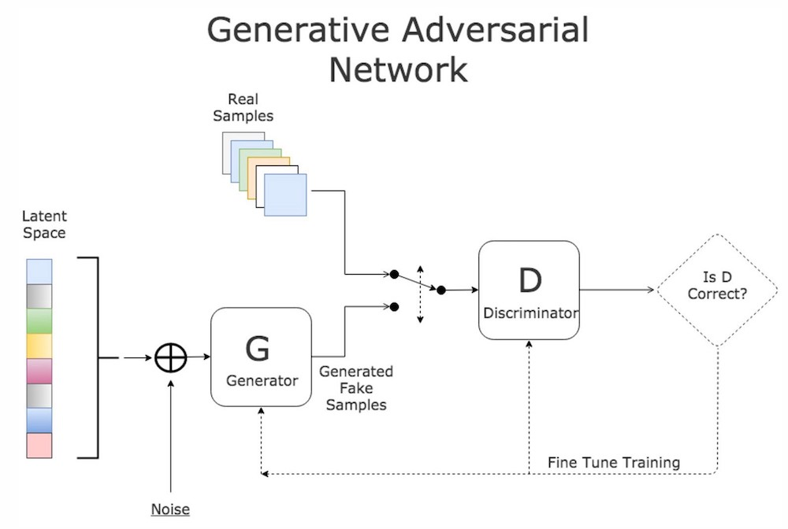
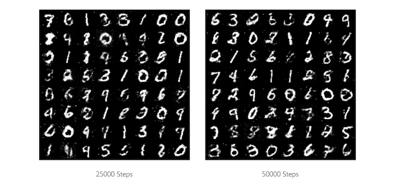
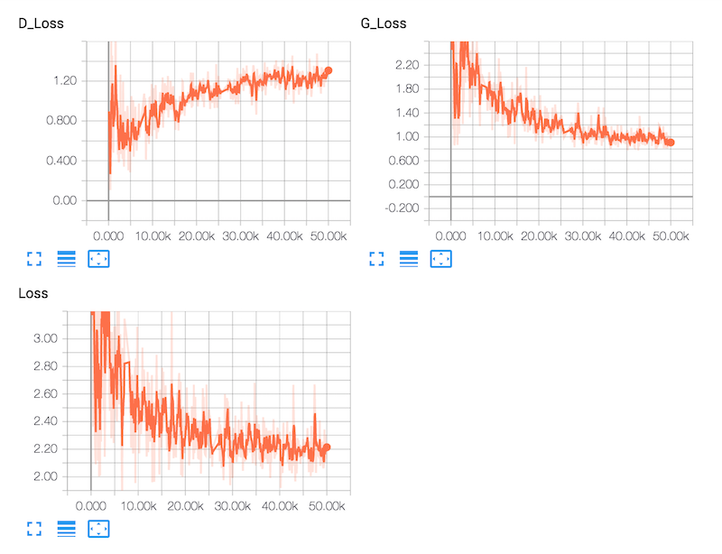

# Generative Adversarial Nets [](https://github.com/hb-research)

PyTorch implementation of [Generative Adversarial Nets](https://arxiv.org/abs/1406.2661).



- [images source](http://www.kdnuggets.com/2017/01/generative-adversarial-networks-hot-topic-machine-learning.html)


## Requirements

- Python 3.6
- PyTorch
- [hb-config](https://github.com/hb-research/hb-config) (Singleton Config)
- [Slack Incoming Webhook URL](https://my.slack.com/services/new/incoming-webhook/)


## Project Structure

    .
    ├── config                  # Config files (.yml, .json) using with hb-config
    ├── gan                     # Generative Adversarial Networks architecture 
        ├── __init__.py             # train, evaluate, predict logic
        ├── module.py               # Discriminator, Generator module
        └── utils.py                # Save and Load Model, TensorBoard
    ├── data_loader.py          # make_data_loader (using DataLoader)
    ├── main.py                 
    ├── model.py                # define Model Spec
    └── model.py                # utils
    
Reference : [hb-config](https://github.com/hb-research/hb-config)

- Manage experiments like [tf.Estimator](https://www.tensorflow.org/api_docs/python/tf/estimator/Estimator)


## Config

Can control all **Experimental environment**.

example: config.yml

```yml
data:
  path: "data/"

model:
  z_dim: 100     # Random noise dimension coming into generator, per output vector
  real_dim: 784

  g_h1: 256
  g_h2: 512
  g_h3: 1024

  d_h1: 1024
  d_h2: 512
  d_h3: 256

  dropout: 0.3

train:
  model_dir: "logs/gan"
  batch_size: 64
  train_steps: 50000

  d_learning_rate: 0.0002  # 2e-4
  g_learning_rate: 0.0002
  optim_betas:
    - 0.9
    - 0.999

  save_checkpoints_steps: 1000
  verbose_step_count: 100

predict:
  batch_size: 64

slack:
  webhook_url: ""  # after training notify you using slack-webhook
```


## Usage

Install requirements.

```pip install -r requirements.txt```

Then, start training

```python main.py --mode train```

After training, generate images

```python main.py --mode predict```

- generated image example




### Experiments modes

:white_check_mark: : Working  
:white_medium_small_square: : Not tested yet.

- :white_medium_small_square: `evaluate` : Evaluate on the evaluation data.
- :white_check_mark: `train` : Fit the estimator using the training data.
- :white_medium_small_square: `train_and_evaluate` : Interleaves training and evaluation.
- :white_check_mark: `predict` : Generate images.

---

### Tensorboar

```tensorboard --logdir logs```

- example




## Reference
- [hb-research/notes - Generative Adversarial Nets](https://github.com/hb-research/notes/blob/master/notes/gan.md)
- [Paper - Generative Adversarial Nets](https://arxiv.org/abs/1406.2661)
- [pytorch-tutorial](https://github.com/yunjey/pytorch-tutorial)


## Author

[Dongjun Lee](https://github.com/DongjunLee) (humanbrain.djlee@gmail.com)
